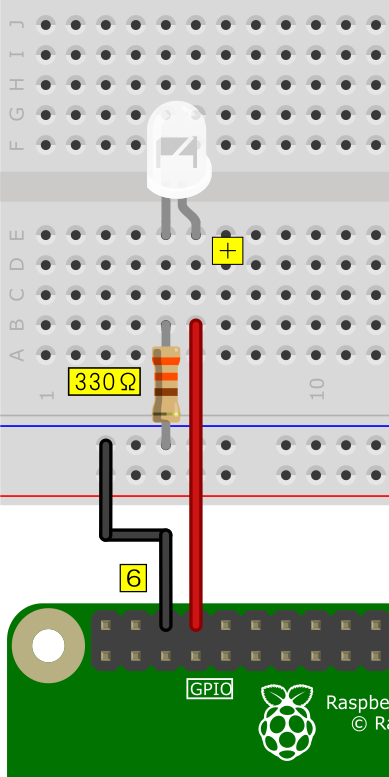
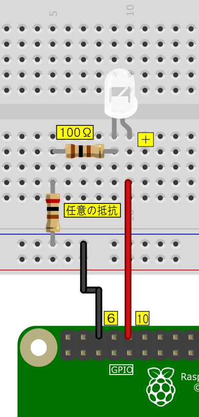

# 02 LED

## 配線

D1(基板上の赤色LED)  
  

J1(外付けLED), J2(任意の外付け抵抗)  
  

## led_on.py

基板上のLED"D1"が点灯します。

## led_off.py

基板上のLED"D1"が消灯します。

## led_pwm.py

基板上のLED"D1"がPWM制御にて点灯します。
PWM値はソース内に記入されています。

## led_blink.py

基板上のLED"D1"が点滅します。
点滅間隔はソース内に記入されています。
