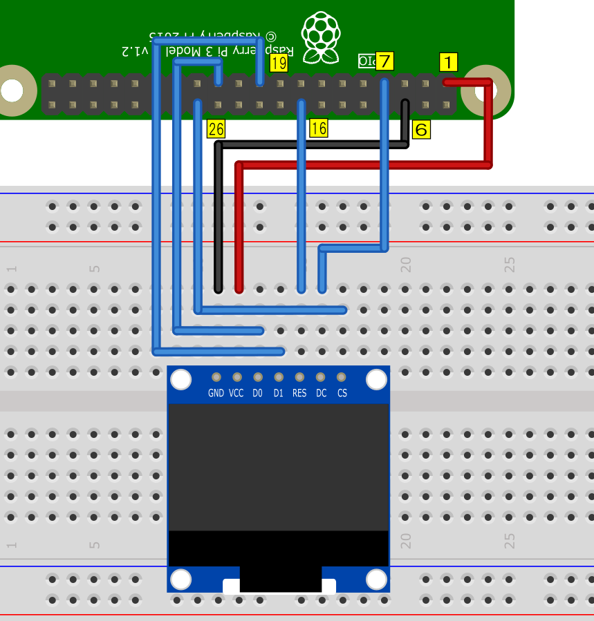

# 07 OLEDディスプレイ

## 配線

## oled_text.py

OLEDにテキストを表示します。
表示するテキストはソース内に記入されています。

## oled_image.py

OLEDに128x64の画像を表示します。
表示する画像は同じフォルダにある"image.png"です。

## oled_weather.py

OLEDに1秒間隔で、BME280から取得した
温度・湿度・気圧のデータを表示します。
