<link href="https://github.com/bit-trade-one/RasPi-Magazine-2019-06/blob/Upload-ready/Readme.css" rel="stylesheet"></link>

## 部品表・取り付け位置

<table>
<tr><td>基板番号</td><td>パーツ名</td><td>品番等</td><td>取り付け位置</td><td>向き</td></tr>
<tr><td>U1</td><td>ICソケット</td><td>8ピン</td><td>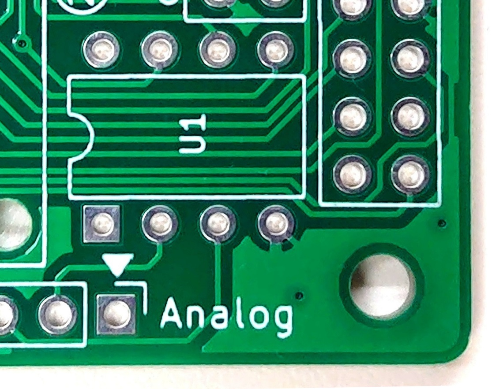</td><td rowspan = "2">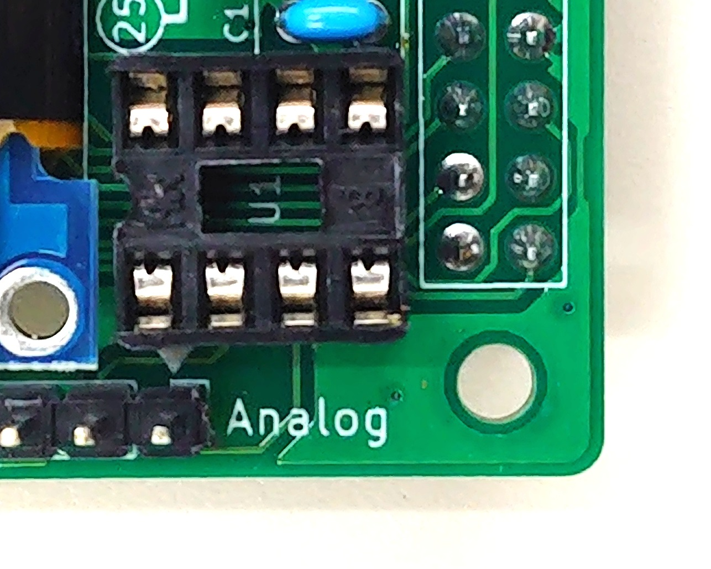</td></tr>
<tr><td>U1</td><td>ADコンバータ</td><td>MCP3002-I/P</td><td>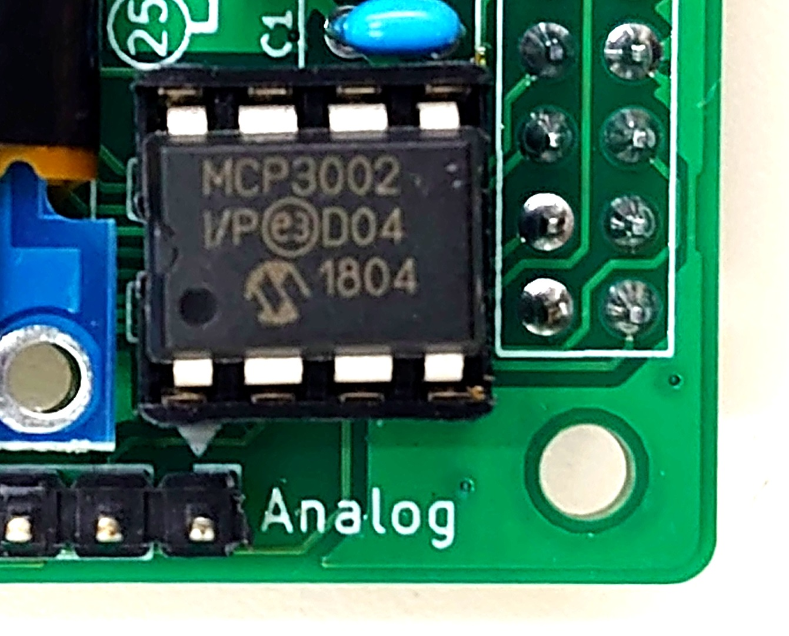</td></tr>
<tr><td>U2</td><td>ICソケット</td><td>22ピン400mil</td><td></td><td rowspan = "2">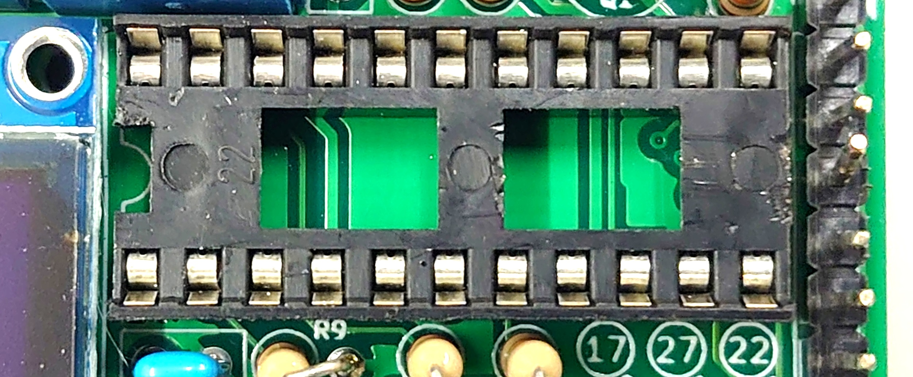</td></tr>
<tr><td>U2</td><td>モータドライバ</td><td>NJM2670D2</td><td>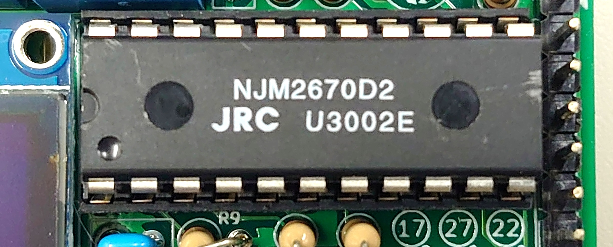</td></tr>
<tr><td>U3</td><td>OLEDグラフィックディスプレイ</td><td>SSD1306</td><td></td><td></td></tr>
<tr><td>Q1</td><td>MOSFET Nch 2N7000</td><td>2N7000</td><td>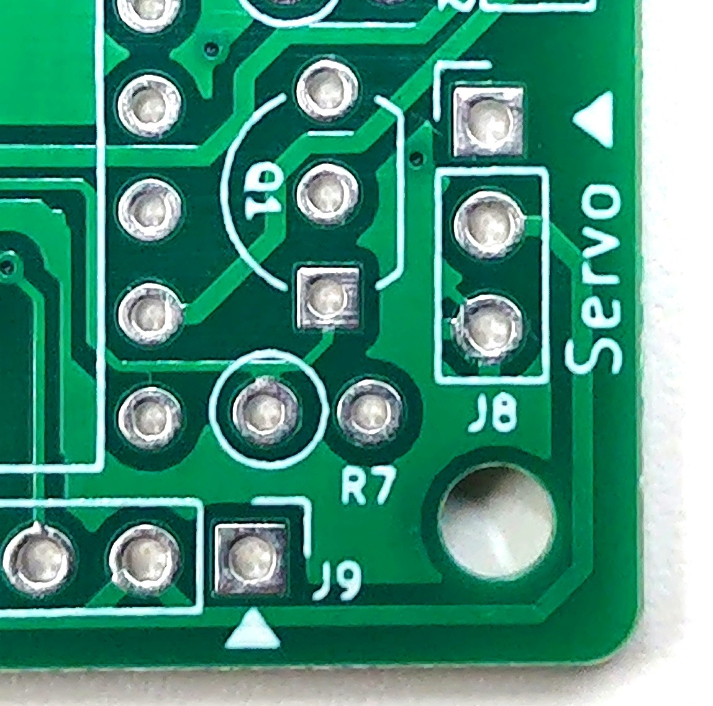</td><td>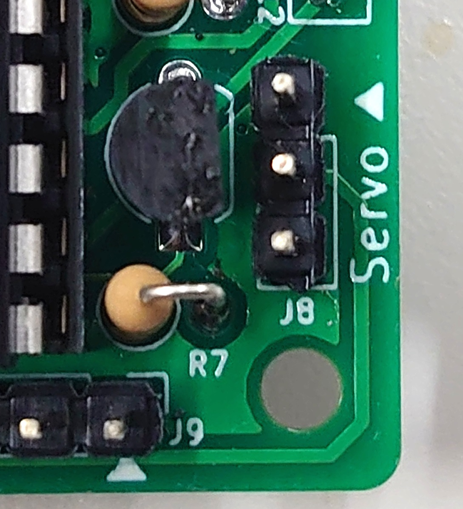</td></tr>
<tr><td>D1</td><td>LED（赤）</td><td>φ3 赤</td><td></td><td>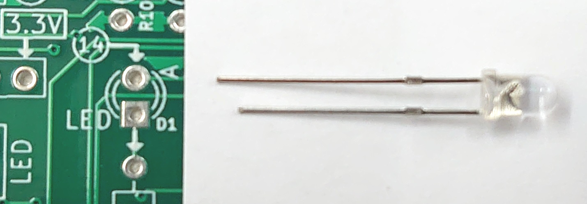</td></tr>
<tr><td>D2</td><td>フルカラーLED</td><td>φ5</td><td></td><td>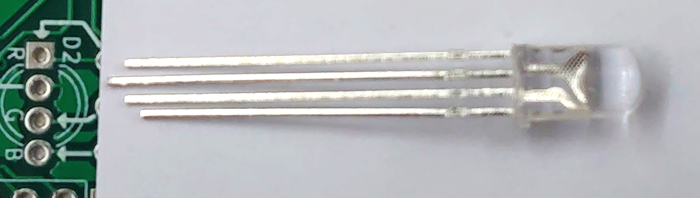</td></tr>
<tr><td>SW1</td><td>タクトスイッチ</td><td></td><td></td><td></td></tr>
<tr><td>R1</td><td>抵抗 1/4W</td><td>330Ω</td><td></td><td><span cc3><span cc3><span cc1><span cc01></td></tr>
<tr><td>R2</td><td>抵抗 1/4W</td><td>100Ω</td><td></td><td><span cc1><span cc0><span cc1><span cc01></td></tr>
<tr><td>R4</td><td>抵抗 1/4W</td><td>1kΩ</td><td></td><td rowspan = "3"><span cc1><span cc0><span cc2><span cc01></td></tr>
<tr><td>R5</td><td>抵抗 1/4W</td><td>1kΩ</td><td></td></tr>
<tr><td>R6</td><td>抵抗 1/4W</td><td>1kΩ</td><td></td></tr>
<tr><td>R7</td><td>抵抗 1/4W</td><td>10kΩ</td><td></td><td rowspan = "6"><span cc1><span cc0><span cc3><span cc01></td></tr>
<tr><td>R8</td><td>抵抗 1/4W</td><td>10kΩ</td><td></td></tr>
<tr><td>R9</td><td>抵抗 1/4W</td><td>10kΩ</td><td></td></tr>
<tr><td>R10</td><td>抵抗 1/4W</td><td>10kΩ</td><td></td></tr>
<tr><td>R11</td><td>抵抗 1/4W</td><td>10kΩ</td><td></td></tr>
<tr><td>R12</td><td>抵抗 1/4W</td><td>10kΩ</td><td></td></tr>
<tr><td>C1</td><td>積層セラミックコンデンサ</td><td>0.1μF 50V 2.54mm</td><td></td><td></td></tr>
<tr><td>C2</td><td>積層セラミックコンデンサ</td><td>0.1μF 50V 2.54mm</td><td></td><td></td></tr>
<tr><td>C3</td><td>積層セラミックコンデンサ</td><td>0.1μF 50V 2.54mm</td><td></td><td></td></tr>
<tr><td>C4</td><td>積層セラミックコンデンサ</td><td>0.1μF 50V 2.54mm</td><td></td><td></td></tr>
<tr><td>JP1</td><td>ピンヘッダ 3P</td><td></td><td></td><td></td></tr>
<tr><td>JP1</td><td>ジャンパーピン 2P つまみ付き</td><td></td><td></td><td></td></tr>
<tr><td>J1</td><td>ピンフレーム 2P</td><td></td><td></td><td></td></tr>
<tr><td>J2</td><td>ピンフレーム 5P</td><td></td><td></td><td></td></tr>
<tr><td>J3</td><td>ターミナルブロック 2P 5.08mm 青</td><td></td><td></td><td rowspan = "3">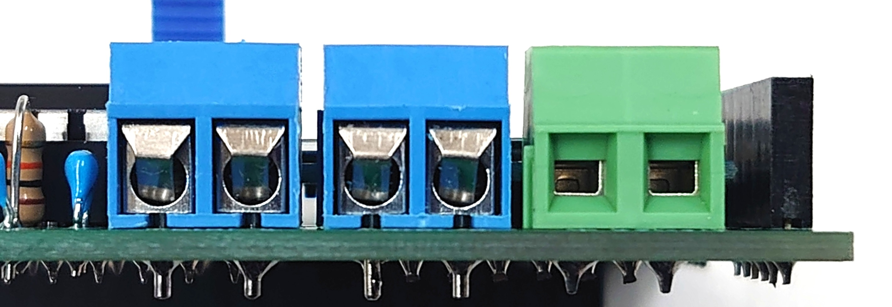</td></tr>
<tr><td>J4</td><td>ターミナルブロック 2P 5.08mm 青</td><td></td><td></td></tr>
<tr><td>J5</td><td>ターミナルブロック 2P 5.08mm 緑</td><td></td><td></td></tr>
<tr><td>J6</td><td>ピンフレーム 6P</td><td></td><td></td><td></td></tr>
<tr><td>J7</td><td>ピンヘッダ 4P</td><td></td><td></td><td></td></tr>
<tr><td>J8</td><td>ピンヘッダ 3P</td><td></td><td></td><td></td></tr>
<tr><td>J9</td><td>ピンヘッダ 9P</td><td></td><td></td><td></td></tr>
<tr><td>J10</td><td>ピンヘッダ 4P</td><td></td><td></td><td></td></tr>
<tr><td>J11</td><td>ピンフレーム 20×2P</td><td></td><td></td><td></td></tr>
</table>

## 初回セットアップ

### I2C/SPI有効化

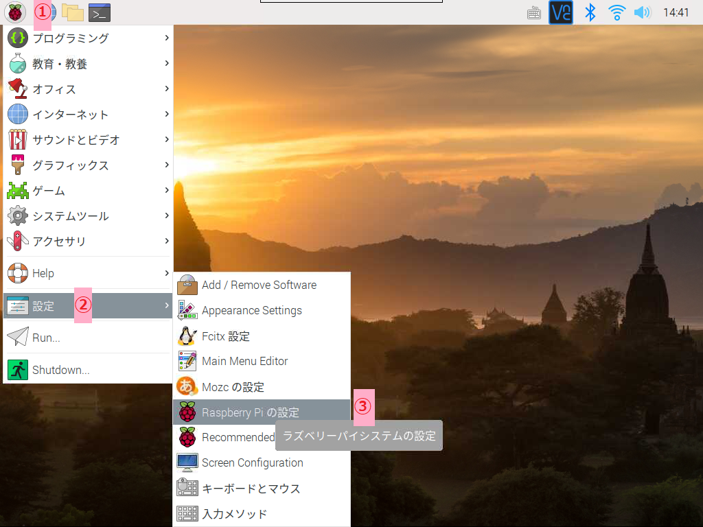
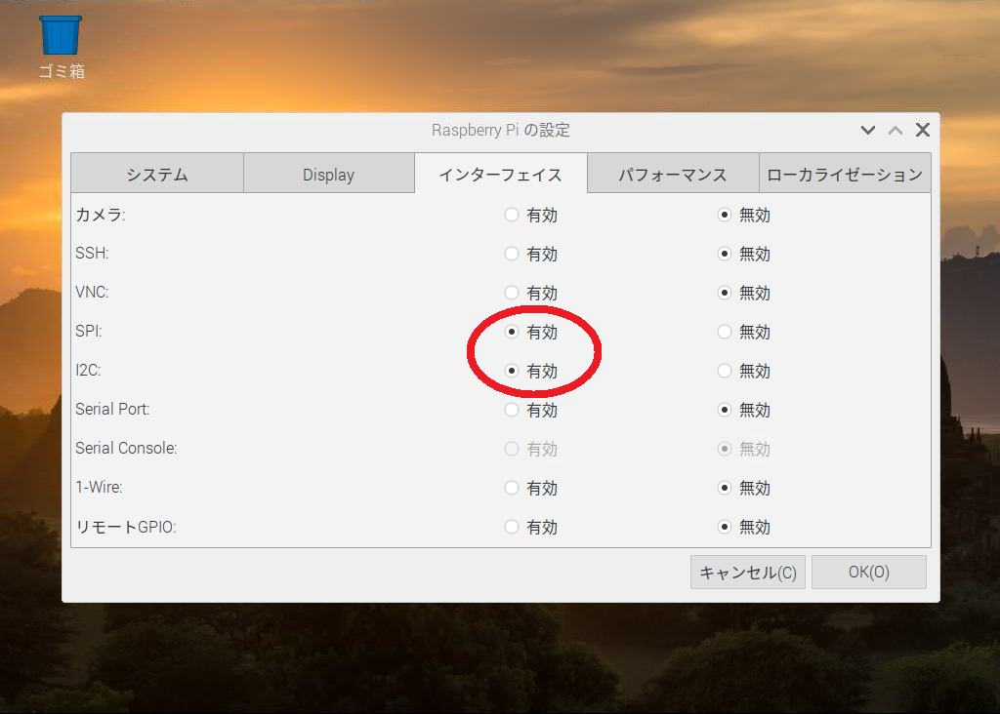

### pigpio有効化

```$ sudo systemctl enable pigpiod```
```$ sudo systemctl start pigpiod```

### OLED用ライブラリ・フォントインストール

```$ sudo apt install fonts-takao```
```$ wget https://github.com/adafruit/Adafruit_Python_SSD1306/archive/master.zip```
```$ unzip master.zip```
```$ sudo python3 master.zip/setup.py install```

### サンプルプログラムダウンロード

```$ wget サンプルプログラムのURL```
```$ unzip サンプルプログラムのzip```

## 02 LED

### led_on.py

### led_off.py

### led_pwm.py

### led_blink.py

## 03 フルカラーLED

### led_color.py

### led_color_hsv.py

### led_color_offset.py

## 04 スイッチ

### sw_read.py

### sw_led.py

## 05 温湿度・気圧センサ

### weather.py

## 06 DCモータ

### motor_foward.py

### motor_reverse.py

### motor_pwm.py

### motor_stop.py

## 07 OLEDディスプレイ

### oled_text.py

### oled_image.py

### oled_weather.py